# Product Pricing Service

Spring Boot REST service that returns the applicable product price for a given application date, product, and brand.

## Hexagonal + DDD Structure

The project is organized as a ports-and-adapters architecture:

- `domain` (inside): business model, policies, and domain exceptions
- `application` (inside): use case ports and use case orchestration
- `infrastructure adapters` (outside): inbound web adapter and outbound persistence adapter
- `infrastructure` (outside): Spring configuration/wiring

Current package layout:

- `com.example.productpricingservice.domain.model`
- `com.example.productpricingservice.domain.service`
- `com.example.productpricingservice.domain.exception`
- `com.example.productpricingservice.application.port.in`
- `com.example.productpricingservice.application.port.out`
- `com.example.productpricingservice.application.usecase`
- `com.example.productpricingservice.infrastructure.adapters.in.web`
- `com.example.productpricingservice.infrastructure.adapters.in.web.dto`
- `com.example.productpricingservice.infrastructure.adapters.out.persistence`
- `com.example.productpricingservice.infrastructure.adapters.out.persistence.entity`
- `com.example.productpricingservice.infrastructure.adapters.out.persistence.repository`
- `com.example.productpricingservice.infrastructure.config`

## Request Flow Diagram

This diagram shows how a GET /api/prices request moves through the hexagonal layers, how the applicable price is selected, and how the response returns to the client.



## Project Starup Guide

- [Start Project Guide](docs/START-PROJECT.md)

## Extraction of Data

The Extraction of data for this project relies on two factors.

1. Indexing the table based on the query of brand, product, start date and end date
1. The repository layer query statement which is as follows:

```
  Select prices where brand = ?brandId, product = ?productId, startDate <=
  ?providedDate and endDate >= ?providedDate, ordered by priority desc and startDate
  desc
```

This ensure that we retrieve the said product and brand and `start date <= provided date <= end date`

## API

Endpoint:

- `GET /api/prices`

Query parameters:

- `applicationDateTime` (ISO date-time, e.g. `2020-06-14T16:00:00`) only supports `LocalDateTime` !!
- `productId` (e.g. `35455`)
- `brandId` (e.g. `1`)

Response:

- `productId`
- `brandId`
- `priceList`
- `startDate`
- `endDate`
- `price`
- `currency`

Example request:

```bash
curl "http://localhost:8080/api/prices?applicationDateTime=2020-06-14T16:00:00&productId=35455&brandId=1"
```

### Possible Responses

- ** 200 OK ** for a valid date, productId and brandId

```json
{
  "productId": 35455,
  "brandId": 1,
  "priceList": 2,
  "startDate": "2020-06-14T15:00:00",
  "endDate": "2020-06-14T18:30:00",
  "price": 25.45,
  "currency": "EUR"
}
```


-**400 Bad Request** for a malformed start date

```json
{
  "code": "INVALID_REQUEST",
  "message": "Method parameter 'startDate': Failed to convert value of type 'java.lang.String' to required type 'java.time.LocalDateTime'; Failed to convert from type [java.lang.String] to type [@org.springframework.web.bind.annotation.RequestParam @org.springframework.format.annotation.DateTimeFormat java.time.LocalDateTime] for value [2020-06-13 15:00:00]"
}
```

- **404 PRICE_NOT_FOUND** for out of range date, product or brand

```json
{
  "code": "PRICE_NOT_FOUND",
  "message": "No price found for product 35455 and brand 1 at 2020-06-13T15:00"
}
```

### Assumptions Made
1. This Service uses `LocalDateTime` assuming that the timezone will always be local, If not `OffsetDateTime` could be used.
2. For Idempotency , inside the `data.sql` file, the content of the table is deleted and recreated to prevent duplicates and errors.
3. Set H2 Database password with environment variable mentioned in the [Start Project Guide](docs/START-PROJECT.md) document.

## H2 Initialization

The in-memory H2 database is initialized at startup using:

- `src/main/resources/schema.sql`
- `src/main/resources/data.sql`


## Useful URLs

- App: http://localhost:8080
- Swagger UI: http://localhost:8080/swagger-ui.html
- H2 Console: http://localhost:8080/h2-console

## Testing Guide

The swagger data to test based on the provided input requirements are as follows:

| Test | Start Date          | Product ID | Brand ID | URL                                                                                                |
| ---- | ------------------- | ---------- | -------- | -------------------------------------------------------------------------------------------------- |
| 1    | 2020-06-14T10:00:00 | 35455      | 1        | http://127.0.0.1:8080/api/prices?applicationDateTime=2020-06-14T10:00&productId=35455&brandId=1    |
| 2    | 2020-06-14T16:00:00 | 35455      | 1        | http://127.0.0.1:8080/api/prices?applicationDateTime=2020-06-14T16:00&productId=35455&brandId=1    |
| 3    | 2020-06-14T21:00:00 | 35455      | 1        | http://127.0.0.1:8080/api/prices?applicationDateTime=2020-06-14T21:00&productId=35455&brandId=1    |
| 4    | 2020-06-15T10:00:00 | 35455      | 1        | http://127.0.0.1:8080/api/prices?applicationDateTime=2020-06-15T10:00:00&productId=35455&brandId=1 |
| 5    | 2020-06-16T21:00:00 | 35455      | 1        | http://127.0.0.1:8080/api/prices?applicationDateTime=2020-06-16T21:00:00&productId=35455&brandId=1 |

Additional Corner Cases to Test

- No price found for given date, product, and brand
- A date that is before or after the startDate or endDate range.